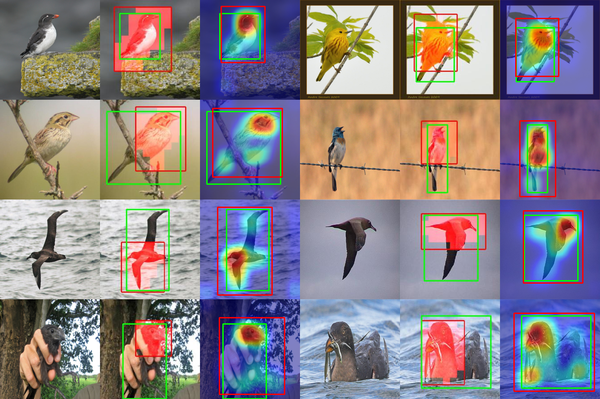

# PsyNet: Self-supervised Approach to Object Localization Using Point Symmetric Transformation
Official Pytorch implementation of "PsyNet: Self-supervised Approach to Object Localization Using Point Symmetric Transformation"   

This implementation is based on these repos.
* [Pytorch Official ImageNet Example](https://github.com/pytorch/examples/tree/master/imagenet)

Pre-trained checkpoints are now available
* Please check the "test" section.

### Joint work with
* Minhyun Lee [github](https://github.com/gaviotas) (Equal contribution)
* Hyunjung Shim [CV](https://sites.google.com/site/katehyunjungshim/) (Corresponding)

## PAPER
This paper is accepted by AAAI 2020. The pdf is available at https://aaai.org/ojs/index.php/AAAI/article/view/6615/6469

## NOTE


## Abstract
Existing co-localization techniques significantly lose performance over weakly or fully supervised methods in accuracy and inference time. In this paper, we overcome common drawbacks of co-localization techniques by utilizing self-supervised learning approach. The major technical contributions of the proposed method are two-fold. 1) We devise a new geometric transformation, namely point symmetric transformation and utilize its parameters as an artificial label for self-supervised learning. This new transformation can also play the role of region-drop based regularization. 2) We suggest a heat map extraction method for computing the heat map from the network trained by self-supervision, namely class-agnostic activation mapping. It is done by computing the spatial attention map. Based on extensive evaluations, we observe that the proposed method records new state-of-the-art performance in three fine-grained datasets for unsupervised object localization. Moreover, we show that the idea of the proposed method can be adopted in a modified manner to solve the weakly supervised object localization task. As a result, we outperform the current state-of-the-art technique in weakly supervised object localization by a significant gap.

## Todo
- [ ] Code Refactoring

## Requirement
  * python 3.6
  * pytorch 1.0.0 or 1.1.0
  * torchvision 0.2.2 or 0.3.0
  * tqdm
  * scipy
  * PIL
  * opencv-python (cv2)
  
## Data Preparation
  * Download "CUB-200-2011" dataset from http://www.vision.caltech.edu/visipedia/CUB-200-2011.html
      * "Stanford Cars" from https://ai.stanford.edu/~jkrause/cars/car_dataset.html
      * "FGVC-aircraft" from http://www.robots.ox.ac.uk/~vgg/data/fgvc-aircraft/
  * Extract in {"CUB", "stanfordCar", "AIRCRAFT/data"}.
  * Then, donwload txt files at [Link](https://drive.google.com/drive/folders/1xU1Mtq84jwmpIa8YdnsZmlcevkEouDCJ?usp=sharing)
  * Place txt file under the dataset directory.
      * For CUB, ../data//CUB/CUB_200_2011/sizes.txt
      * For CARs, ../data/stanfordCar/devkit/cars_train_sizes.txt and ../data/stanfordCar/devkit/cars_test_sizes.txt
      * For Airplane, ../data/AIRCRAFT/data/images_train_size.txt and ../data/AIRCRAFT/data/images_val_size.txt and ../data/AIRCRAFT/data/images_test_size.txt
  * Example directory hierarchy(CUB) :../data/CUB/CUB_200_2011
  ```
  Project
  |--- data
  |    |--- CUB
  |          |--- CUB_200_2011
  |                    |--- images
  |                    |      |--- 200 directories (001.Black ... ~ 200.Common ...)
  |                    |--- sizes.txt
  |--- PsyNet
       |--- models
       |        |--- networks.py
       |        |--- resnet.py
       |        |--- ...
       |--- main.py 
       |--- train.py
       | ...
       
  ```
   
## How to Run
### Arguments
-
   
### Train
```
python -W ignore main.py --dataset CUB --network vggcam16bn --tftypes OR
```

### Test
* Checkpoints
    * [Link](https://drive.google.com/drive/folders/1xU1Mtq84jwmpIa8YdnsZmlcevkEouDCJ?usp=sharing)
* Performance
    * CUB - 83.78
    * CARs - 95.59
    * Aircraft - 96.61
   
* How to load .ckpt (Pre-trained checkpoint)
```
python -W ignore main.py --gpu 5 --dataset CUB --network vggcam16bn --tftypes OR --validation --load_model CUB_VGG16BN
python -W ignore main.py --gpu 5 --dataset AIRCRAFT --network vggcam16bn --tftypes OR --validation --load_model Aircraft_VGG16BN
```

## References
-
